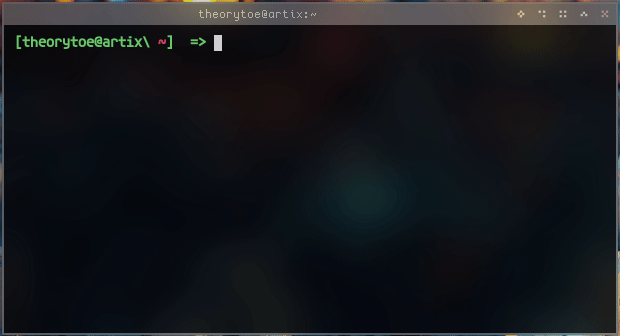
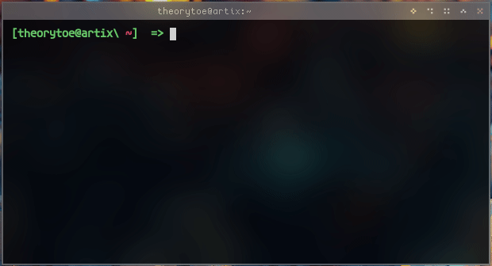
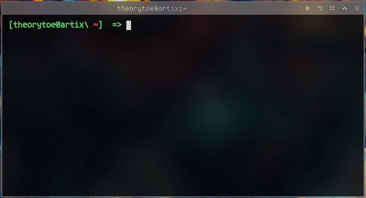

## Genpass

genpass is a small little utility that generates secure passwords and prints to stdout.

passwords created with genpass can also be piped, allowing for use in a clipboard.

passwords can also be easily written to files easily.

### Build process

requirements:
- `GNU make`
- `g++`

If you have gnu make simply run `make` and it should spit out a binary `genpass`

### Usage
`genpass [LENGTH]` Where length is the desired length of the password.
passing a `-h` option diplays the help dialoge.
